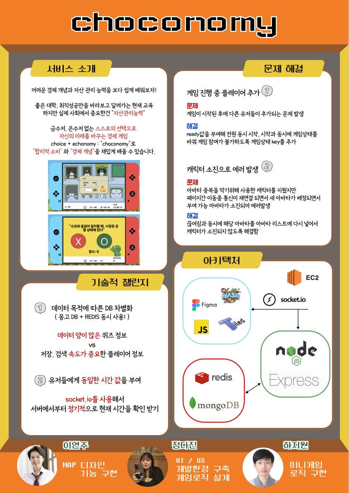

# 크래프톤 정글 2기 레드반 나만의 무기 1팀 프로젝트 Choconomy

팀원: 정다진, 이연주, 하지원

프로젝트 원본 링크
https://github.com/djinii/krafton_jungle3

게임 설명:
초등학생을 위한 경제 관념 게임

필수 환경:
Node.js 18버전 이상 필요

### 설치할 모듈:
npm install 명령어로 필요한 모듈 설치
- "body-parser": "^1.20.2"
- "cookie-parser": "^1.4.6"
- "dotenv": "^16.3.1"
- "express": "^4.18.2"
- "express-session": "^1.17.3"
- "http": "^0.0.1-security"
- "ioredis": "^5.3.2"
- "module_name": "^1.0.0"
- "moment": "^2.29.4"
- "mongoose": "^7.4.3"
- "nodemon": "^3.0.1"
- "path": "^0.12.7"
- "phaser": "^3.60.0"
- "redis": "^4.6.7"
- "socket.io": "^4.7.2"
- "socket.io-client": "^4.7.2"

### 게임 진행 방식:

- Nickname 입력 칸에 사용자 명을 입력하고 Create 버튼을 누르면 'success'라는 알림창이 뜬다. 그 이후에 Ready 버튼을 누르면 '준비가 완료되었습다'라는 창이 뜨면 접속 완료

- 주어진 30분 동안 1초마다 돈과 체력이 떨어지는데, 시간이 모두 초과되거나 돈이나 체력 중 하나라도 0이 되면 해당 유저의 게임은 종료되고 최종 점수가 결정된다 (현재 가진 금액 + 예금 + 집값 - 대출).

- 최종적으로 최종 점수가 가장 높은 사용자가 우승한다(화면에 순위 반영은 미구현).

### 나의 기술적 챌린지:

- 시간 값을 포함하여 돈, 체력, 능력치 등의 값을 서버에서 클라이언트로 보낼 때 "socket" 변수의 위치 문제로 인해 socket.emit() 방식으로 보내는데 어려움을 느껴 io.emit()이 사용자 전체에게 이벤트와 변수를 전달함을 알고 있었음에도 이 방식으로 전달했지만, 결국 여러 사용자가 접속하면 서로의 값이 겹치면서 깜빡이는 버그를 맞이했다. 이에 대한 해결책으로 시간 단위로 실시간으로 변하는 돈과 체력 수치는 sockete.emit()으로 전달이 가능하게끔 코드를 수정했고, 그 외의 나머지 능력치, 예금, 대출 등의 값들은 REST API의 POST로 전달되도록 하여 문제 해결

## 포스터

